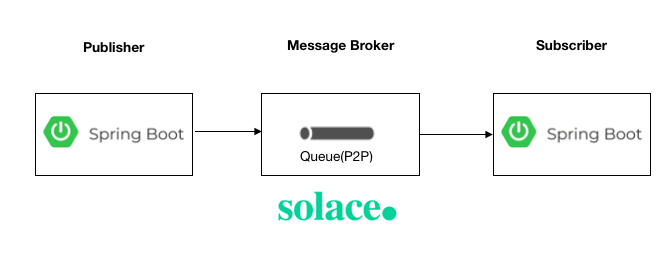
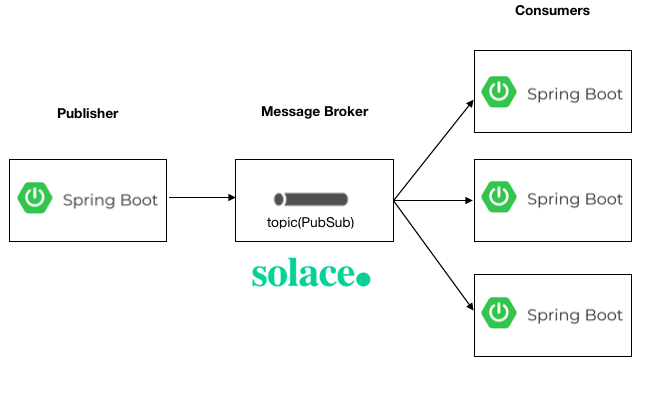

# spring-boot-solace-messaging

This repository contains spring boot samples integrated with solace message broker.

#### Run solace as docker container

```
$ docker run -d -p 8080:8080 -p 55555:55555 --shm-size=2g --env username_admin_globalaccesslevel=admin --env username_admin_password=admin --name=solace solace/solace-pubsub-standard
```

* Access Solace GUI http://localhost:8080

# Solace P2P( Point to Point) 

Point to Point messaging using queue destination type.




# Solace PubSub( Publish Subscribe) 

PubSub messaging using topic destination type


